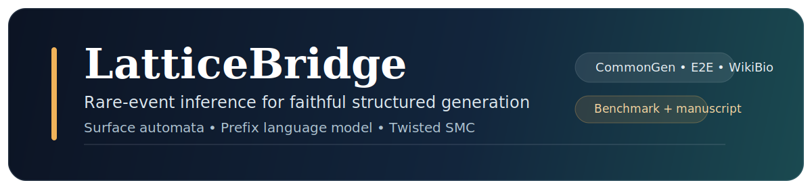
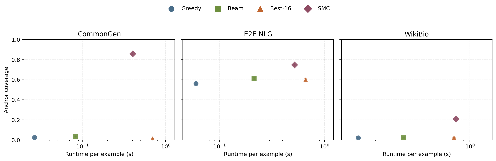

# LatticeBridge



LatticeBridge studies **faithful structured generation as a rare-event sequential inference problem**. The repository targets the regime in which a conditional language model can usually produce fluent text, but the probability mass assigned to continuations that satisfy several input-derived anchors at once is small. It implements a compact end-to-end stack for that regime:

- a reusable **surface-automaton** constraint layer
- a compact **prefix language model** for structured-to-text generation
- a **twisted sequential Monte Carlo** decoder with resampling and multilevel splitting
- a three-dataset benchmark over **CommonGen**, **E2E NLG**, and **WikiBio**
- a manuscript, figures, diagnostics tables, and runnable benchmark artefacts

Dataset adapters expose source-side phrases; the inference code only sees anchors, automaton states, and model scores.

## Benchmark Scope

The reported structured validation benchmark covers **2,610 attainable tasks**:

- **993** CommonGen examples
- **996** E2E NLG examples
- **621** WikiBio examples

Each task uses up to three input-derived anchors that are attested in at least one reference surface. Among attested candidates, anchor selection is ranked by **empirical source information score**, not adapter field order. The benchmark reports:

- exact anchor satisfaction
- mean anchor coverage
- ROUGE-L and token-level overlap
- runtime per example
- particle diagnostics such as ESS, acceptance mass, and resampling count

Final aggregate metrics are written to:

- `results/benchmark_structured_validation/validation_summary.json`
- `results/benchmark_structured_validation/validation_tasks.json`
- `results/benchmark_structured_validation/validation_config.json`
- `results/benchmark_structured_validation/example_diagnostics.json`

## Current Validation Snapshot



### CommonGen

| Method | Success | Coverage | ROUGE-L | Runtime (s) |
| --- | ---: | ---: | ---: | ---: |
| Greedy | 0.000 | 0.025 | 0.222 | 0.027 |
| Beam filter | 0.000 | 0.036 | 0.183 | 0.082 |
| Best-of-16 ancestral | 0.000 | 0.016 | 0.169 | 0.697 |
| Twisted SMC | **0.648** | **0.859** | 0.217 | 0.403 |

### E2E NLG

| Method | Success | Coverage | ROUGE-L | Runtime (s) |
| --- | ---: | ---: | ---: | ---: |
| Greedy | 0.149 | 0.561 | 0.434 | 0.060 |
| Beam filter | 0.252 | 0.611 | **0.442** | 0.214 |
| Best-of-16 ancestral | 0.370 | 0.601 | 0.376 | 0.660 |
| Twisted SMC | **0.397** | **0.747** | 0.282 | 0.520 |

### WikiBio

| Method | Success | Coverage | ROUGE-L | Runtime (s) |
| --- | ---: | ---: | ---: | ---: |
| Greedy | 0.000 | 0.022 | **0.201** | 0.150 |
| Beam filter | 0.000 | 0.021 | 0.178 | 0.324 |
| Best-of-16 ancestral | 0.003 | 0.023 | 0.163 | 0.762 |
| Twisted SMC | **0.019** | **0.209** | 0.128 | 0.790 |

The benchmark exposes a consistent operating pattern:

- on CommonGen, twisted SMC is the only tested decoder with substantial exact success
- on E2E NLG, twisted SMC gives the best exact success and the widest coverage margin
- on WikiBio, exact satisfaction remains difficult for all methods, but twisted SMC still lifts mean coverage by an order of magnitude over the greedy baseline

## Quick Start

### 1. Stage the datasets

```bash
PYTHONPATH=src python3 -m latticebridge.cli prepare \
  --manifest data/manifests/structured_benchmark.json \
  --cache-root data/cache \
  --processed-root data/cache/processed_structured \
  --tokenizer-corpus data/cache/tokenizer_corpus_structured.txt \
  --dotenv .env
```

The structured manifest stages CommonGen, E2E NLG, and WikiBio. Public downloads work without authentication, but `HF_TOKEN` can be provided through `.env` for Hugging Face-hosted assets.

### 2. Train the proposal model

```bash
PYTHONPATH=src python3 -m latticebridge.cli train \
  --processed-root data/cache/processed_structured \
  --tokenizer-corpus data/cache/tokenizer_corpus_structured.txt \
  --tokenizer-path artifacts/tokenizer_structured.json \
  --checkpoint-dir artifacts/checkpoints_structured \
  --device mps \
  --epochs 5 \
  --batch-size 48 \
  --max-tokens 160 \
  --seed 13
```

`--device` may be switched to `cpu` or `cuda`. The paper uses the same checkpoint for all reported decoding methods.

### 3. Run the structured validation benchmark

```bash
PYTHONPATH=src python3 -m latticebridge.cli benchmark \
  --processed-root data/cache/processed_structured \
  --tokenizer-path artifacts/tokenizer_structured.json \
  --checkpoint artifacts/checkpoints_structured/best.pt \
  --output-dir results/benchmark_structured_validation \
  --split validation \
  --per-dataset-limit 1000 \
  --max-new-tokens 64 \
  --max-anchors 3 \
  --min-anchors 2 \
  --beam-size 6 \
  --num-samples 16 \
  --particles 96 \
  --lambda-weight 2.0 \
  --twist-scale 2.0 \
  --sample-temperature 0.95 \
  --smc-temperature 0.9 \
  --ess-threshold 0.5 \
  --split-interval 12 \
  --elite-fraction 0.2 \
  --seed 13 \
  --device mps \
  --log-interval 50
```

The benchmark now writes partial JSON snapshots during long runs, so intermediate progress is not lost if the process is interrupted.

### 4. Render summary figures

```bash
PYTHONPATH=src python3 -m latticebridge.cli figures \
  --summary-path results/benchmark_structured_validation/validation_summary.json \
  --output-dir results/figures \
  --train-report artifacts/checkpoints_structured/train_report.json
```

### 5. Build appendix diagnostics

```bash
PYTHONPATH=src python3 -m latticebridge.cli diagnostics \
  --results-path results/benchmark_structured_validation/validation_results.json \
  --config-path results/benchmark_structured_validation/validation_config.json \
  --processed-root data/cache/processed_structured \
  --tokenizer-path artifacts/tokenizer_structured.json \
  --split validation \
  --output-json results/benchmark_structured_validation/example_diagnostics.json \
  --output-tex paper/generated/example_diagnostics.tex \
  --per-dataset-examples 8
```

### 6. Run the synthetic rare-event stress probes

```bash
python3 latticebridge_synthetic_lab.py \
  --scenario conflict_probe \
  --seq-len 96 \
  --rank 256 \
  --replicas 12 \
  --particles 8192 \
  --device mps \
  --log-interval 16
```

```bash
python3 latticebridge_synthetic_lab.py \
  --scenario scale_probe \
  --seq-len 128 \
  --rank 320 \
  --replicas 16 \
  --particles 16384 \
  --device mps \
  --log-interval 16
```

```bash
python3 latticebridge_synthetic_lab.py \
  --scenario scale_probe \
  --seq-len 160 \
  --rank 384 \
  --replicas 24 \
  --particles 24576 \
  --device mps \
  --log-interval 16
```

## Repository Layout

```text
assets/                     README visuals
artifacts/                  tokenizer and checkpoint reports
data/manifests/             dataset staging manifests
paper/                      manuscript source and bibliography
results/                    benchmark summaries, diagnostics, and figures
src/latticebridge/          reusable library code
tests/                      lightweight regression tests
```

## Figures and Paper

The paper source is under `paper/`. The compiled manuscript lives at [`paper/latticebridge.pdf`](paper/latticebridge.pdf).

To rebuild it:

```bash
cd paper
latexmk -pdf -interaction=nonstopmode -halt-on-error latticebridge.tex
```

Benchmark-derived manuscript assets are stored alongside the repository:

- `paper/generated/example_diagnostics.tex` is generated from benchmark outputs
- `results/figures/` contains the PNG figures used by the manuscript
- `results/benchmark_structured_validation/` contains the benchmark summary files cited in the text

## Citation

If you use the repository or manuscript, cite the paper metadata in [`CITATION.cff`](CITATION.cff).
