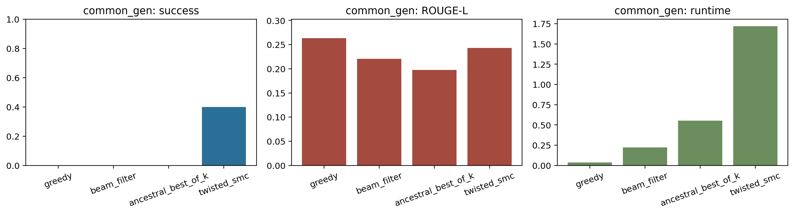
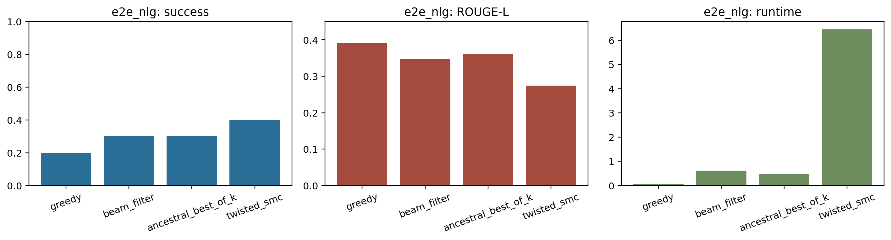
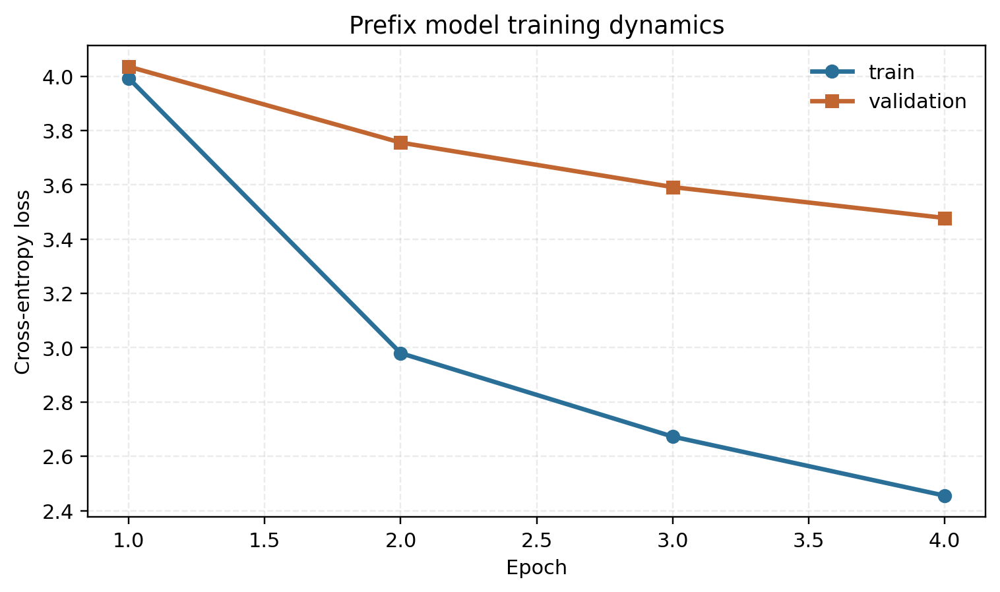
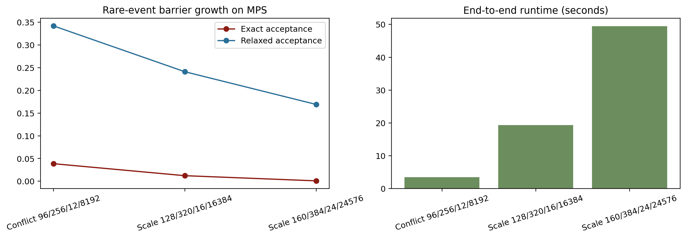

# LatticeBridge


LatticeBridge is a compact implementation of **rare-event inference for structured sequence generation**. It targets the regime where a conditional autoregressive model can produce fluent text, but assigns low probability to continuations that satisfy several input-derived anchors simultaneously. The implementation combines:

- a compact prefix language model trained for structured-to-text tasks
- **surface automata** compiled directly from instance-provided anchors
- **twisted sequential Monte Carlo** with resampling and multilevel splitting
- an MPS-compatible synthetic scale lab for controlled rare-event workloads

Constraint handling is instance-driven. The decoder does not use hardcoded topic lists, rule-based label maps, or global keyword classes.

Repository: <https://github.com/farukalpay/latticebridge>

## Method

LatticeBridge treats constrained structured decoding as a sequential rare-event inference problem:

1. serialize the structured source into a prefix
2. compile input-derived anchors into a surface-level product automaton
3. decode with a twisted SMC bridge that rewards progress toward acceptance
4. report coverage, overlap quality, runtime, and particle diagnostics

## Current Results

The fast validation benchmark in `results/benchmark_core_fast/validation_summary.json` uses CommonGen and E2E NLG with a compact MPS-friendly budget (`10` tasks per dataset, `24` particles for Twisted SMC). The important signal is not leaderboard chasing; it is whether constraint satisfaction improves in a measurable, reproducible way.

### CommonGen

| Method | Success | Coverage | ROUGE-L | Runtime (s) |
| --- | ---: | ---: | ---: | ---: |
| Greedy | 0.00 | 0.10 | 0.263 | 0.037 |
| Beam Filter | 0.00 | 0.13 | 0.221 | 0.222 |
| Best-of-6 Ancestral | 0.00 | 0.03 | 0.198 | 0.554 |
| Twisted SMC | **0.40** | **0.80** | 0.243 | 1.721 |

### E2E NLG

| Method | Success | Coverage | ROUGE-L | Runtime (s) |
| --- | ---: | ---: | ---: | ---: |
| Greedy | 0.20 | 0.53 | **0.392** | 0.057 |
| Beam Filter | 0.30 | 0.57 | 0.347 | 0.620 |
| Best-of-6 Ancestral | 0.30 | 0.57 | 0.361 | 0.475 |
| Twisted SMC | **0.40** | **0.80** | 0.274 | 6.451 |

Interpretation:

- Twisted SMC materially improves exact anchor satisfaction and average coverage.
- The gain is not free: overlap-based quality metrics drop when the bridge places too much mass on anchor realization.
- Runtime should be read together with coverage; the method is a controlled inference baseline, not a leaderboard claim.

Generated figures:

- 
- 
- 
- 
- 

## MPS Scale Probes

The compatibility launcher `cscl_attribute_doob_splitting_lab.py` delegates to a neutral synthetic rare-event systems lab. The following MPS runs were executed:

| Scenario | Exact Accept | Relaxed Accept | Mean ESS | Runtime (s) |
| --- | ---: | ---: | ---: | ---: |
| `conflict_probe`, `96/256/12/8192` | 0.0386 | 0.3419 | 5189.0 | 3.49 |
| `scale_probe`, `128/320/16/16384` | 0.0122 | 0.2410 | 10348.7 | 19.38 |
| `scale_probe`, `160/384/24/24576` | 0.000854 | 0.1690 | 15843.5 | 49.43 |

The heavy run shows barrier growth: runtime and ESS remain tractable on MPS while exact satisfaction decreases by nearly two orders of magnitude.

## Quick Start

### 1. Prepare the benchmark corpora

```bash
PYTHONPATH=src python3 -m latticebridge.cli prepare \
  --manifest data/manifests/core_benchmark.json \
  --cache-root data/cache \
  --processed-root data/cache/processed_core \
  --tokenizer-corpus data/cache/tokenizer_corpus_core.txt \
  --dotenv .env
```

`core_benchmark.json` uses CommonGen and E2E for the default fast loop. `datasets.json` additionally includes the WikiBio adapter for larger runs. Public downloads do not require a token, but `HF_TOKEN` can be supplied through `.env` for Hugging Face-hosted assets.

### 2. Train the prefix language model

```bash
PYTHONPATH=src python3 -m latticebridge.cli train \
  --processed-root data/cache/processed_core \
  --tokenizer-corpus data/cache/tokenizer_corpus_core.txt \
  --tokenizer-path artifacts/tokenizer_core.json \
  --checkpoint-dir artifacts/checkpoints_core \
  --device mps \
  --epochs 4 \
  --batch-size 48 \
  --max-tokens 144
```

### 3. Run the fast benchmark

```bash
PYTHONPATH=src python3 -m latticebridge.cli benchmark \
  --processed-root data/cache/processed_core \
  --tokenizer-path artifacts/tokenizer_core.json \
  --checkpoint artifacts/checkpoints_core/best.pt \
  --output-dir results/benchmark_core_fast \
  --split validation \
  --per-dataset-limit 10 \
  --max-new-tokens 48 \
  --beam-size 4 \
  --num-samples 6 \
  --particles 24 \
  --lambda-weight 1.8 \
  --twist-scale 2.0 \
  --device mps
```

### 4. Render summary figures

```bash
PYTHONPATH=src python3 -m latticebridge.cli figures \
  --summary-path results/benchmark_core_fast/validation_summary.json \
  --output-dir results/figures \
  --train-report artifacts/checkpoints_core/train_report.json
```

### 5. Run the user-requested stress probes

```bash
python3 cscl_attribute_doob_splitting_lab.py \
  --scenario conflict_probe \
  --seq-len 96 \
  --rank 256 \
  --replicas 12 \
  --particles 8192 \
  --device mps \
  --log-interval 16
```

```bash
python3 cscl_attribute_doob_splitting_lab.py \
  --scenario scale_probe \
  --seq-len 128 \
  --rank 320 \
  --replicas 16 \
  --particles 16384 \
  --device mps \
  --log-interval 16
```

```bash
python3 cscl_attribute_doob_splitting_lab.py \
  --scenario scale_probe \
  --seq-len 160 \
  --rank 384 \
  --replicas 24 \
  --particles 24576 \
  --device mps \
  --log-interval 16
```

## Repository Layout

```text
assets/                     banner and README visuals
data/manifests/             benchmark and optional dataset manifests
paper/                      manuscript source and bibliography
results/                    benchmark outputs, figures, and scale probe logs
src/latticebridge/          library code
  benchmarks/               generation runners and benchmark tasks
  constraints/              token and surface automata
  data/                     downloaders and dataset adapters
  experiments/              prepare/train/benchmark/figure commands
  lab/                      synthetic rare-event scale probes
  models/                   tokenizer and prefix LM
```

## Design Notes

- **Constraint representation:** phrases are compiled into surface automata, not keyword classes.
- **Control signal:** Twisted SMC uses distance-to-acceptance progress, resampling, and splitting. There is no hand-authored topic logic.
- **Separation of concerns:** dataset adapters are thin and schema-aware; the inference library is reusable and dataset-agnostic.
- **Apple Metal posture:** all reported training and stress runs target `mps`.

## Limitations

- The fast benchmark is intentionally small. It is meant to show the rare-event trade-off clearly and reproducibly, not to claim SOTA.
- The current bridge improves anchor satisfaction more than fluency. A learned twist head or self-distilled proposal is the next structural improvement.
- WikiBio support is implemented but not part of the default fast loop because the public archive is much heavier to stage locally.

## Paper

The manuscript source lives under `paper/`. The compiled PDF is available at [`paper/latticebridge.pdf`](paper/latticebridge.pdf) and currently renders to 22 pages with 25 bibliography entries.

To rebuild it:

```bash
cd paper
latexmk -pdf -interaction=nonstopmode -halt-on-error latticebridge.tex
```
